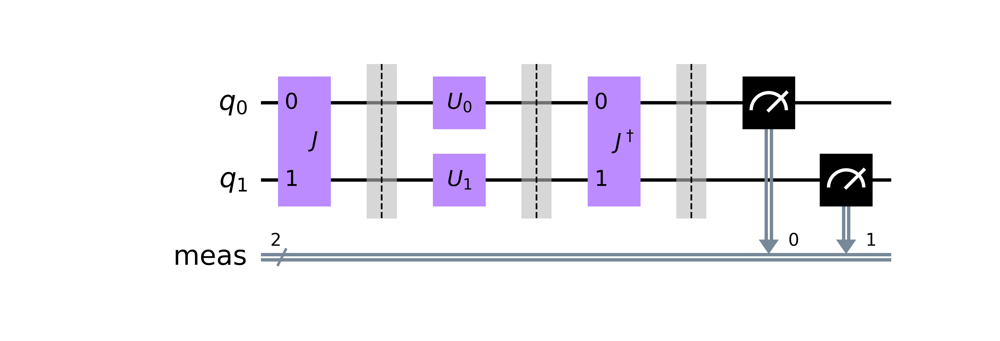

# EWL

A simple Python library to simulate and execute EWL quantum circuits on IBM Q.



## Installation

```bash
pip install ewl
```

## Usage

```python
from ewl import *

ewl = ExtendedEWL(
    psi=(ket('00') + i * ket('11')) / sqrt(2),  # initial state
    alice=U(theta=pi/2, alpha=pi/2, beta=0),  # quantum strategy
    bob=U(theta=0, alpha=0, beta=0)  # classical strategy
)

ewl.draw()

ewl.draw_transpiled(backend_name='ibmq_athens', optimization_level=3)

ewl.simulate()

ewl.run(backend_name='ibmq_athens', optimization_level=3)
```
